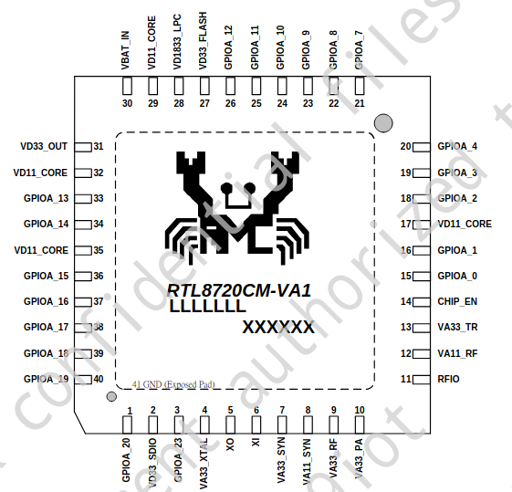
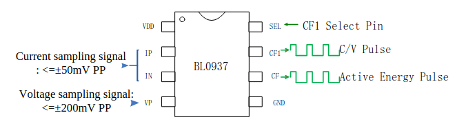
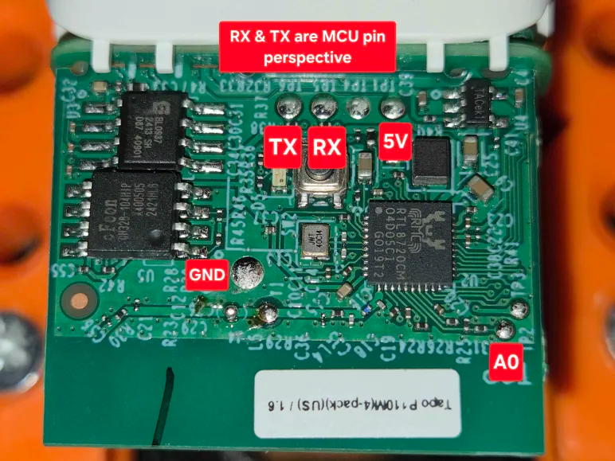

# Tapo P110M Smart WiFi Plug

These are nice and small, and support up to 15 Amp loads.  Two can be plugged into a single two position outlet, but they are too wide to plug in side-by-side on a two-gang, two outlet box.  Thus far, we've been unable to interface with the energy monitor chip, but otherwise have full control of the device.  We're continuing to try and figure out the energy monitoring, and will update this repo as soon as we've figured it out.

Dimensions, not including AC prongs: 66mm (2.6") wide by 38mm (1.5") tall by 40mm (1.6") deep.

We've worked with v1.6 plugs, which use an RTL8720CM controller.  The energy monitor chip is a BL0937.

The initial reflash requires opening up the plug and physically connecting to the daughterboard.  If you enable OTA in your firmware, you won't have to open it up again for later updates, such as enabling power monitoring when available.  Note that the plug won't be Matter compatible after it is reflashed.

## Shucking

There is a single T-6 Torx screw on the back of the plug.  There are two tabs on the top and the bottom (long sides) of the front shell.  The tabs are a little deeper than some similar devices, so be prepared for slightly more aggressive prying to release them.  If done carefully, the plug shell won't be damaged by disassembling it.  

USE CAUTION - There's a foam gasket under the manual switch on the side.  This gasket provides some spriginess to the switch, so try not to damage it as the plug is being disassembled.  Once the four tabs securing the two main parts have been released, you'll need to pry a little more to make the gasket clear the outer switch button.  The gasket needs to be removed from the daughterboard to connect the programmer. It needs to be reattached before reassembly, and you'll need to use caution reassembling the plug so that it is properly positioned without rolling up and interfering with the pushbutton.

Also be aware that the outer switch face isn't permanently attached, so may fall off when the plug is disassembled.

## Interface Pinout

- User Pushbutton: P17
- Relay control pin: P14
- Blue LED Pin: P18
- Orange LED Pin: P19
- BL0937 SEL Pin: P2
- BL0937 CF Pin: P3
- BL0937 CF1 Pin: P4

## Re-flash connections to daughterboard

