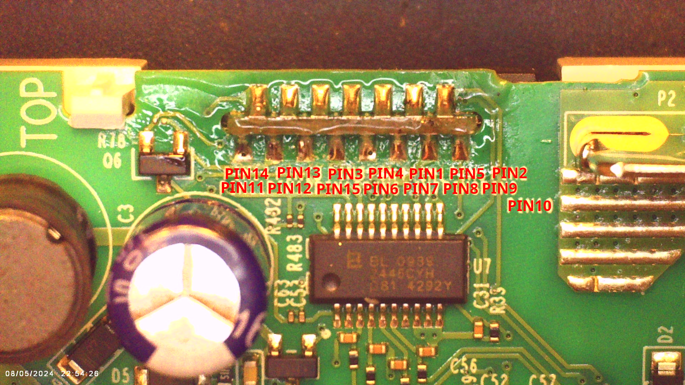
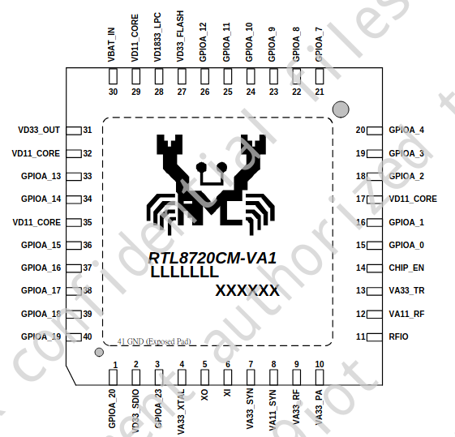
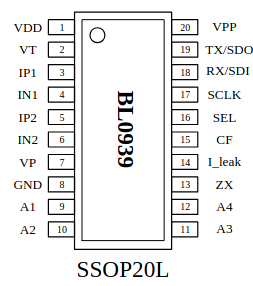

# Tp-Link Tapo P210M Matter Compatible Outlet

This information is for US Version 1.6.

This outlet uses the Realtek RTL8720CM WiFi/ Bluetooth microcontroller and 20 pin BL0939 energy monitor chip.

Keep in mind that this outlet is larger than a regular electrical outlet.  It extends 38mm (1.5") into the electrical box, at 44mm (1.75") wide and 70.5mm (2.75") high.

## TOOLS
- Philips screwdriver - #0 or #1
- Torx T-8 Driver

## Relevant Connections
The RTL8720 and external flash, etc. is on a daughterboard that is soldered to the main circuit board.  This is the pinout, specifying the pins connected to the RTL8720.

## Onboard ICs

