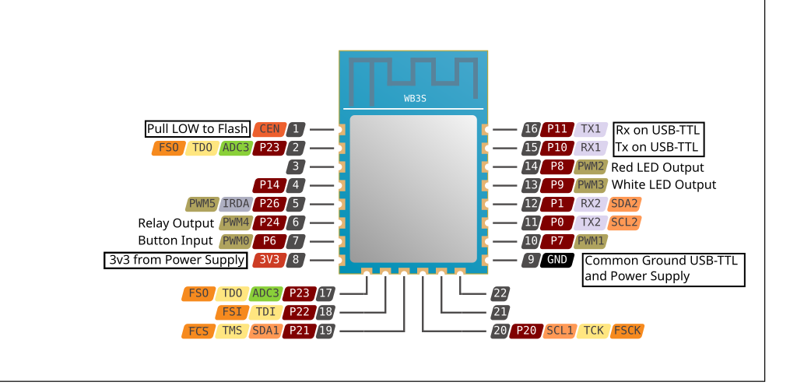

# TreatLife Light Switch Conversion

I have deployed three Homeassistant networks and try to avoid third-party services whenever possible.  I have created a large number of ESPHome devices, which control sensors, outlets and lights.  With the large number of ESPHome devices, I am very comfortable with YAML configuration for ESPHome.

TreatLife has a number of smart mains-powered light switches, but they are tethered to TreatLife services.  I have sought and found how to re-flash the switches with ESPHome.  Thus far, I have converted TreatLife standard and SS01 three-way light switches, and am endeavoring to convert DS01C dimmers.  Each type of switch has a different function, therefore requires a different YAML configuration.

The conversion process requires the switch to be opened up, and wires to be connected to the SoC module on the front panel of the switch.  It requires a USB-to-TTL converter to upload the new firmware, and also requires a separate 3.3v power source.  Once the ESPHome firmware is compiled, ltchiptool is used to perform the upload.  The CEN pin on the module needs to be held low as it is powered up, and it should be released when ltchiptool is attempting to connect to and flash the firmware.

> [!IMPORTANT]
> Release CEN when ltchiptool displays the following:
```
I: To enter download mode, the chip has to be rebooted while the flashing program
I: is trying to establish communication.
I: In order to do that, you need to bridge CEN pin to GND with a wire.
```

> [!IMPORTANT]
> A separate 3.3 volt power source is required, as most USB-TTL converters don't provide enough current to flash the module.  Ensure the USB-TTL converter, module and power supply share a common ground

> [!CAUTION]
> Do not connect the switch to mains power when the case is open

## Examination and configuration
I have thus far acquired TreatLife switches with modules marked as WB3S and CB3S.  LibreTiny supports WB3S with BK7231T or BK7231N chips.  It doesn't yet support CB3S modules with BK7238 chips.  It appears that the LibreTiny team is working on support for BK7238-based modules.

Once the switch is opened, look at the silkscreen on the antenna part of the controller module.  It will let you identify the module type, but not the controller chip inside.  Your YAML file will have to specify the module and chip type.

## Specify board in YAML
Enter the module type in the board definition.  You may need to experiment to select the proper family. If the switch doesn't respond correctly after flashing, reverify the module type, and try the alternate family if one exists.  Selecting the wrong board or family WILL NOT brick the switch, it just won't work as expected.

### WB3S modules
```
bk72xx:
  board: wb3s
  family: bk7231t   # If it doesn’t boot, change to bk7231n
  framework:
    version: latest
```
### CB3S modules
```
bk72xx:
  board: cb3s
  family: bk7238
  framework:
    version: latest
```
> [!IMPORTANT]
> The CB3S isn't currently supported by LibreTiny.  This WILL NOT WORK at time of last update to this repo.

## Flash procedure
1. Compile the firmware with ESPHome
2. Locate the firmware, which should be at <YAML source dir>/.esphome/build/\<device name\>/.pioenvs/\<device name\>/firmware.bin
3. Connect the USB-to-TTL converter to your computer
4. Ensure the SoC is powered down
5. From the directory containing the firmware, enter

```ltchiptool flash write firmware.bin```

6. Press enter to execute, and as soon as the system attempts to connect to the module:
    - Pull CEN on the module to ground
    - Power up the module
    - As soon as the flash process begins, allow CEN on the module to float by disconnecting the ground connection
7. It will take a short time for the firmware to upload
8. Once the flash process is complete, power cycle the module.  The USB-TTL converter can remain connected as you check whether the firmware operates as desired.

## SS01S Standard Switch
These are the simplest of the switches.  Since they control the only relay in the circuit, they can detect whether the light is switched on.  I prefer the white LED to be on when the light is off and for it to be off when the light is on.  This logic can be managed with the ESPHome YAML, but can also be controlled via HA if exposed.  The firmware should allow the user to restart the switch via the main button, so the button configuration should provide multi-click actions.

- Relay to switch mains power
- White LED
- Red LED
- Input from button for user input
  
## SS01 Three-way Switch
These operate very similar to the SS01S standard switches, but since the switch-light configuration includes two switches which can independently turn the light on or off, the code has to be slightly different.  These switches can only detect the state of their own relay, so can't reliably detect whether the light is on.  Homeassistant will need to account for this lack of affirmative light state reporting by the switches.  I prefer the white LED to be on when the light is off, and off when the light is on. Unlike the SS01S switches, Homeassistant will have to use the following truth table to determine the state of the light.

Truth Table

SW1  SW2  Light

OFF  OFF  OFF

ON   OFF  ON

OFF  ON   ON

ON   ON   OFF



## DS01C Dimmer
These are the most complex of the switches.  They use a relay to switch mains power, and a TRIAC to control dimming.  They have a red LED and a white LED, as well as a sensor to specify the dimming level, and LEDs to display current set level.
- Relay to switch mains power
- TRIAC control pin for dimming
- White LED
- Red LED
- Input from button for On/Off user input
- Input from front face for dimming setting
